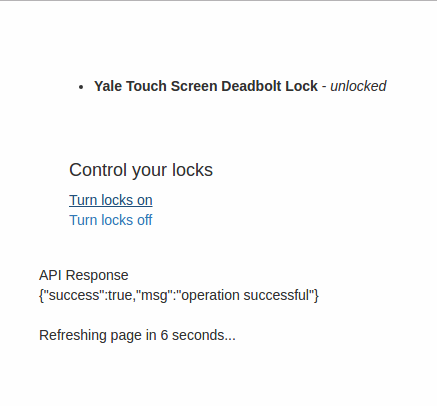

# xmart-things-demo

This is a sample application that uses [xmart_things](https://github.com/techgaun/xmart-things) to interact with Web Services SmartApp.

- [Sample Web Services SmartApp groovy script](priv/smartapp/lock.groovy)
- [Auth Controller](web/controller/auth_controller.ex) has callback route and stores smartthings access token and smartthings endpoint URI for SmartApp in user session.
- [Page Controller](web/controller/page_controller.ex) has lock related routes and handles listing lock devices and also turning the locks on and off.

To start your Phoenix app:

  * Install dependencies with `mix deps.get`
  * Install Node.js dependencies with `npm install`
  * Start Phoenix endpoint with `mix phoenix.server`

Now you can visit [`localhost:4000`](http://localhost:4000) from your browser.

## Configuration

You have to configure `xmart_things` configuration by setting appropriate environment variables. Look at the [config](config/config.exs#L21-L25)

On the SmartThings side, configure a new app using [Sample Web Services SmartApp groovy script](priv/smartapp/lock.groovy).
